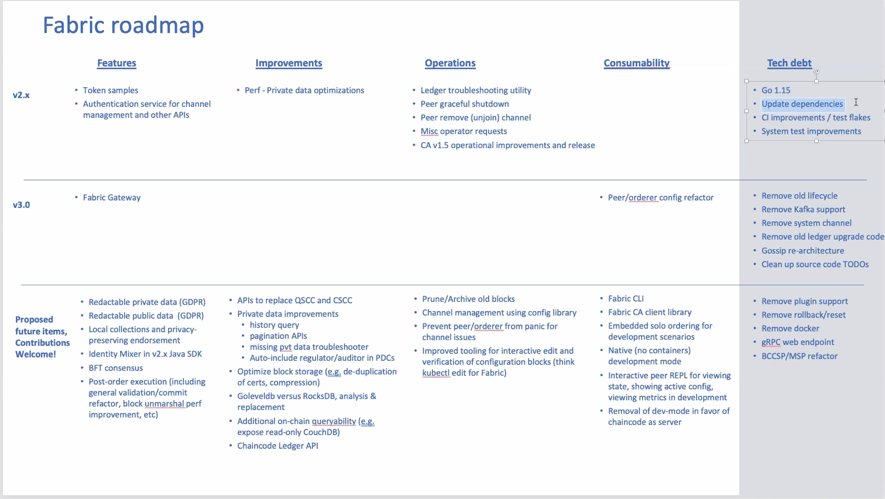
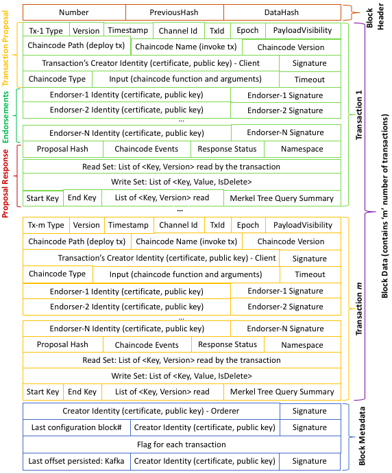
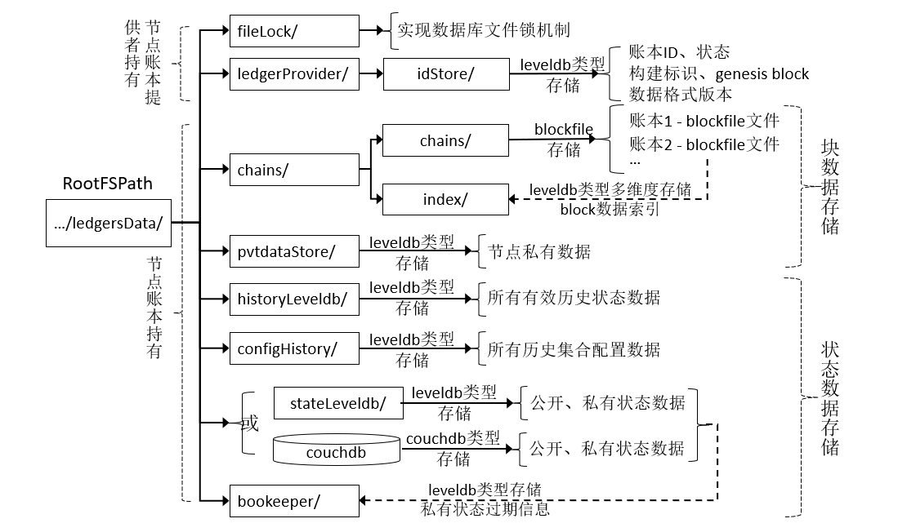

# Hyperledger Fabric 
- **Q: Fabric接下来的发展方向有哪些？**
    
    
    
    
    


- **Q: Ethereum面临很多安全方面的问题，请问Fabric现在是否也面临一些安全性相关的问题呢？**
    - 无论对于以太坊还是fabric或者其他的区块链框架，只要智能合约的可拓展性达到图灵完备的级别，则必然会像其他所有的软件项目一样遇到安全攻防问题。没有银弹，传统的安全审计，黑白盒穿透测试仍然可以有助于预防和解决具体项目中的问题。
- **Q: 为何Fabric逐步将允许不同节点上的智能合约不一致**
    - 主要是针对不同组织对于同一个交易的检查逻辑不同的场景，比如之前说的，有的组织可能要检查信用记录，而其他组织只检查余额等等
    - 如果没有这样的需求，依然可以用当前的方式
    - 即使使用当前的Fabric，合约内容是不上链的，一个组织完全可以通过修改peer逻辑跳过check，从而运行不同的代码
    - 即使合约上链，比如以太坊，依然可以实现一个新的节点，用不同的方式运行合约，一样无法保证执行过程一致
    - 最终来讲是要对结果(读/写集合)共识，而不是过程
- **Q: Endorser根据什么信息判断是否给某个具体的transaction endorse**
    - 目前主要检查权限策略，用户也可以自定义 ESCC。1.3版本引入的新的背书策略，使得颗粒可细化到数据库键值级别，详情可搜索关键字`key level endorsement policies`
- **Q: putstate上传键值对的时候，放在invoke函数里的时候，提示成功，但是查询不到数据，这是为什么呢**
    - Fabric 采用两阶段交易（2 phase commit）模型，链码的执行没有错误后，链码中putState的函数结果是只会在proposal response中将key value信息添加进入写集（write set），而并不会立即写入账本，成功的信息会与proposal response一并返回，这时候如果没有proposal response提交到orderer，则不会落账，写集信息更不会写入peer，因此查询不到写集所包括的数据。
    - 另可以参考 fabric-chaincode-go当中的注释
    - `Invoke is called to update or query the ledger in a proposal transaction. Updated state variables are not committed to the ledger until the transaction is committed.`
- **Q: 交易如何保证无关人员不能查看，从而保证隐私呢？通过交易证书吗？ 登记证书应该是保证用户和节点的身份信息。**
    - 目前，主要通过通道、sideDB 等特性保护隐私。也可以在智能合约里通过交易发起人的证书通过合约代码逻辑做认证。此外，1.2版本引入了更细化的通道接入权限控制，详情搜索Access Control Lists (ACL)
- **Q: Fabric性能怎么样，有没有可靠的测试报告**
    - Hyperledger Caliper可以用于做fabric的基准测试。此外TWGC也维护了一个轻量级的Fabric专用交易生成器[Tape](https://github.com/Hyperledger-TWGC/tape)
- **Q: 目前 Fabric 的orderer相当于一个中心化的节点，感觉这与分布式和区块链有点违背？**
    - 支持多个Orderer，分布式部署实现排序服务。
    - Fabric是通过交易流程实现的PBFT，而不是通过OrdererType
    - 社区当中有两个BFT的OrdererType正在酝酿，现在的进度瓶颈主要来自于Orderer本身的机制在引入BFT之前需要重构
- **Q: SBFT目前是否有任何时间表？**
    - 暂时没有。
- **Q: Fabric应用于物联网系统有没有推荐的方法？现阶段嵌入式设备可以部署成Fabric节点吗？**
    - 建议把设备端作为Fabric的Client。 出于运算和存储能力的考虑，不建议直接部署 Fabric节点
- **Q: 目前对于Fabric的可回溯性，除了一笔一笔交易去遍历，还有什么比较好的方法吗?**
    - 对于某个特定的key, 可以通过合约内的ChaincodeStub.GetHistoryForKey API去查询它的值历史
- **Q: 相较`Hyperchain`等联盟链的“万级”TPS，导致Fabric性能不高的原因有哪些?**
    - Fabric 目前单通道暂时只能达到 1~20 K 的TPS，限制其性能的因素包括本地硬盘读写速度、CPU 核数和网络吞吐，本质上是由于其间多次的非对称加解密操作。
- **Q: Fabric 的链码对于调用者是完全可见的吗？就是说每个链码的调用者都能看到链码的逻辑吗？**
    - 调用者属于客户端，一般情况看不到服务端的链码逻辑。如果客户端获得了权限且peer开启了生命周期链码，可以通过lscc的api获取链码数据
- **Q: Fabric网络完全启动后，不停止网络的情况下，能够完成排序服务的切换吗？比如卡夫卡切换为solo**
    - kafka切换为solo暂时不支持，但是从1.4.2开始，官方文档提供了将kafka切换成RAFT（etcdraft）的方法，此外，社区推荐用单节点的etcdraft配置来取代solo的配置
- **Q: 我们每次实例化或者升级chaincode的时候，都会新建一个新的链码 docker 镜像和容器，如果我们想定制化默认的链码镜像，比如预先安装一些其他应用，使得初始化的时候有一个预期的环境， 我们应该如何做？镜像的Dockerfile在哪里呢？**
    - 每个类别的链码（Go, Java, Nodejs）有着对应的Dockerfile。不过Dockerfile的内容实际上是内嵌在节点二进制程序文件里面的，因此除非修改节点程序本身，否则你无法修改Dockerfile的内容。在接下来2.0的版本里，你将会可以构建你自己的链码启动器，因此，将可以如你所愿的任何方式来构建/部署链码。 实际上与此同时，你既可以修改用于构建链码的镜像，也可以修改用于运行链码的镜像
    - 关于构造：
        - 在1.4.x的版本中，Go和Nodejs的链码是用fabric-ccenv的镜像来构建的（你可以在Fabric源码中images/ccenv目录下找到Dockerfile）。如果你构建时需要任何额外的库，你可以基于fabric-ccenv来构建自己的镜像。要特别注意的是，对Go链码来说我们只会采用编译后的二进制链码文件，该文件是在实际的链码容器里构建和使用的。类似地，Nodejs链码中我们采用的是已安装的node 应用（包含node_modules）.通过设置peer 配置文件里chaincode.builder属性，你可以指定你自己的链码构造器为你定制的镜像。特别要注意的是java实际上是用"chaincode.java.runtime"镜像来构造的（你可以在fabric-chaincode-java代码仓库里找到fabric-javaenv）。
        - 在2.0中，Nodejs链码使用fabric-nodeenv镜像（在fabric-chaincode-node代码仓库里）而不是fabric-ccenv镜像
    - 关于运行：
        - 在1.4.x，fabric-ccenv镜像会构建链码二进制文件/Nodejs应用，以用于构建世纪的链码镜像。本质上，它只是复制了这些内容到运行时镜像里（通过配置文件里的"chaincode.golang.runtime", "chaincode.java.runtime", "chaincode.node.runtime"属性来指定）。因此，假如你的Go链码需要调用了外部共用库，你可以将他们添加到适当的基础运行时镜像里。对于Go链码来说是fabric-baseos镜像，对于Nodejs链码来说是fabric-baseimage
        - 在2.0中，Nodejs链码也是使用的fabric-nodeenv作为运行时镜像

- **Q: Fabric相关的代码仓库迁移到github这个过程的现状**
    - 已经完成
- **Q: Fabric 的国密改造案例**
    - TWGC Fabric国密小组收集了众多的[已知开源改造案例](https://github.com/Hyperledger-TWGC/fabric-gm-wiki/wiki/%E5%B7%B2%E7%9F%A5%E5%BC%80%E6%BA%90%E9%A1%B9%E7%9B%AE)
    - TWGC Fabric国密小组正采取一种完全不同的路线来统一Fabric国密改造，[欢迎贡献](https://github.com/Hyperledger-TWGC/fabric-gm-wiki)
- **Q: 根据Fabric官方文档，区块（block）包括block header、block data和block metadata，block data包含交易记录。请问交易记录包含哪些数据单元（数据项）？**
    - 区块体结构见图
    
    
- **Q: Fabric 的账本数据放在哪里，以什么结构存放的，分别存放了些什么？**
    - peer 的账本默认存放在 `/var/hyperledger/production`。可以通过core.yaml 当中的`peer.fileSystemPath`属性来控制
    
    - orderer 的账本默认存放在`/var/hyperledger/production/orderer`。可以通过orderer.yaml当中的`FileLedger.Location`属性来控制
    
- **Q: peer 节点的7051端口是通的，为啥7053端口不通呢？**
    - 7053端口暴露的服务是eventHub，现在已经被ChannelEventHub代替，ChannelEventHub复用了7051端口，因此7053不再被使用了
- **Q：chaincode instantiate链码实例化的时候出现如下错误**
    ```
    Error: could not assemble transaction, err proposal response was not successful, error code 500, msg error starting container: error starting container: 
    Failed to generate platform-specific docker build: Error returned from build: 1 "chaincode/input/src/github.com/ ...: cannot find package "..." in any of:
    ```
    - 该错误只发生在golang chaincode中。通常是由于chaincode的源码根目录下缺少vendor目录以及所包括的第三方依赖，如果在源码中调用了非fabric的依赖，必须先将这些依赖本地化到vendor目录中，作为链码安装前的准备工作。Fabric链码实例化过程中，会基于fabric-baseenv的docker image启动一个容器，专门编译chaincode，然后会基于baseos和编译结果，制作chaincode image
- **Q: 如何给Fabric提issue**
    - Fabric 团队已将issue的平台从JIRA迁移往[Github Issue](https://github.com/hyperledger/fabric/issues)，详情见[20210818-贡献者会议录像](https://wiki.hyperledger.org/display/fabric/Contributor+Meetings+2021?preview=%2F41590443%2F56723444%2F20210818_contributors_meeting.mp4)
    
- **Q: ECert和TCert是什么**
    - Tcert 即交易证书，设计理念上说，允许发起的每一次交易都使用独立的交易证书。ECert 即Enrollment certificate。TCert与ECert的实现最早出现在0.6版本中，而在1.x时期被重新设计，通过IdeMix实现TCert，而独立的Fabric-ca将给每一个身份签发ECert，详情可参考[StackOverFlow相关问题](https://stackoverflow.com/questions/47645800/transaction-certificate-tcerts-in-hyperledger-fabric-1-0)
